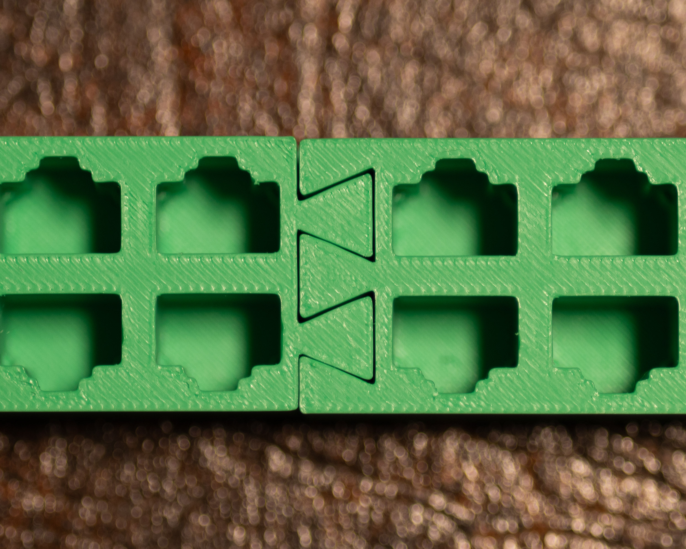
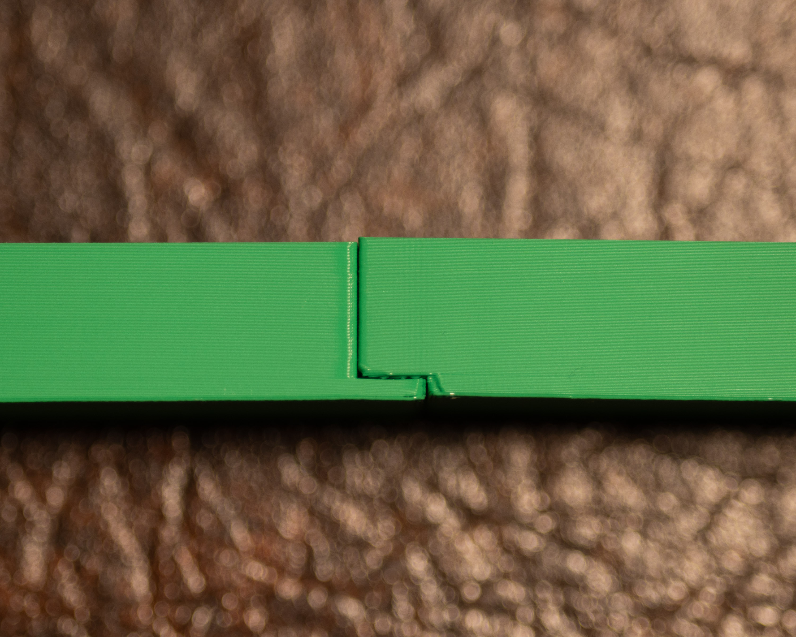

# RJ-45-blank-blocks
## Introduction
My coworkers know that I dabble in 3D design and asked me to design an RJ-45 blank panel for them to use during switch replacements. Their process goes something like this:
- Copy the port configuration from the old switch to the new.
- For each blade, plug the cables into the corresponding ports on the blank. We use a different color block for each blade. (e.g., blade 1 = green block, blade 2 = yellow block, etc.)
- Remove the old switch and install the new one.
- Reverse the process, connecting the cables from the blanks to the corresponding ports on the new switch.

## Some notes about the blocks
I've included multiple block variants to suit different printers and use cases. Some are better than others; there are even a few versions with 16 ports per section (instead of 12) because I designed from memory instead of checking an actual switch blade. (Oops.)

Here's what's available:
- A full 48-port block in one piece (for large-format printers). It will fit diagonally on larger beds.
- A two-part 48-port version (right and left halves) for smaller printers. The pieces fit together loosely and won't hold together with friction. I use E6000 glue and clamp overnight for a solid bond.
- A single port version to test what print orientation will work best for your needs.

The ports have a really satisfying click! If you need a fidget toy, the single port blank might be fun. If you annoy your coworkers, maybe don't tell them where you found the design!

## Semi-planned future enhancements
- Rounded corners (fillets) to improve print reliability with PETG filament.
- Backplates for all block designs. I've had better print success with the backplates on them. Tree supports are super easy to snap out with a pair of curved forceps.
- A more modular system, including center pieces, not just left/right halves. This one's a lower priority since we haven't found a compelling use case yet.

## License - no commercial use
Please be sure to read the license file. You may not sell these files (and any derivatives)!

## Buy me a coffee (OK, it's really a beer)
If you're interested in buying me a beer, you can use the link below. Please don't put in more than $5 - I'm just doing this for fun.

## Pictures of the final product
The pictures below show the two-section blocks and how they fit together.

